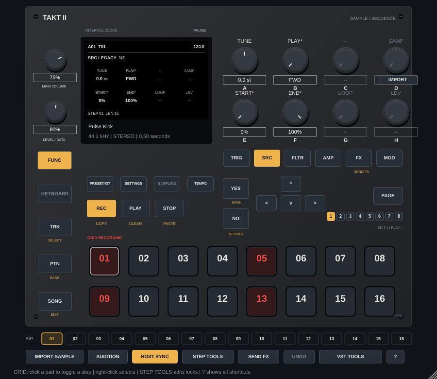

# Takt II — sampler séquenceur VST3

Une réimplémentation indépendante de fonctions du **Digitakt II** pour **Windows 64 bits et Ableton Live**, écrite en C++17/JUCE. Le plugin s'appelle **Takt II**. Le projet contient également une application autonome et une cible Linux pour les tests.

Il s'agit d'une première version fonctionnelle, pas d'une émulation sonore certifiée de la machine. Le moteur, l'interface et les sons de démonstration sont originaux ; ils ne contiennent pas de firmware ni de banque de sons Elektron.

La priorité est maintenant la **fidélité de l'interface et du workflow musical** du Digitakt II, avec les samples importés par l'utilisateur. Overbridge et les fonctions de connexion au matériel sont hors périmètre. Les décisions de référence sont conservées dans [docs/PRODUCT_SCOPE.md](docs/PRODUCT_SCOPE.md).

Le manuel officiel **OS 1.17** et les notes des versions ont été analysés avec
des agents. La [spécification de workflow](docs/WORKFLOW_SPEC.md) décrit les
références et les étapes d'implémentation. Cette branche fournit **0.3.0 en développement** :
machines SRC, trois LFO par piste, enveloppes et filtres, conditions avancées,
banques, chaînes et Song Mode. **La version stable 0.2.0 reste sur `main`.**



Le [guide du workflow 0.3](docs/WORKFLOW_0_3.md) explique les gestes,
la compatibilité et les adaptations de cette branche. Le
[guide 0.2](docs/WORKFLOW_0_2.md) reste disponible pour l'installation stable.
Les contrôles encore absents restent désactivés ; le travail restant est explicite.

## Jouer dans Live

1. Copier le dossier complet `Takt II.vst3` dans `C:\Program Files\Common Files\VST3\` (ou un dossier VST3 personnalisé de Live).
2. Activer les plugins VST3 dans **Préférences → Plug-ins** et relancer l'analyse.
3. Charger **Takt II** sur une piste MIDI. Activer **HOST SYNC** dans le plugin et lancer le transport de Live : le pattern de démonstration joue immédiatement.
4. Les notes MIDI **36 à 51** déclenchent les pistes **1 à 16**, indépendamment du séquenceur. Cette correspondance est propre au plugin.
5. Sélectionner une piste, utiliser **IMPORT SAMPLE**, activer **REC** pour éditer les pas, puis cliquer sur les pads pour écrire un pattern. Avec REC désactivé, les pads jouent les pistes. Les sons intégrés permettent de jouer sans importer de fichiers.

Avec **HOST SYNC** désactivé, **PLAY** permet la lecture et la pause au tempo interne. Les samples et le pattern sont intégrés dans l'état du plugin enregistré avec le projet Live ; le fichier original peut ensuite être déplacé.

## Fonctions implémentées

| Élément | Comportement |
| --- | --- |
| Audio | 16 pistes stéréo, une voix de sample par piste, mixage de sortie stéréo |
| Samples | WAV, AIFF, FLAC ; mono dupliqué en stéréo ; rééchantillonnage linéaire ; 60 s maximum par sample |
| Lecture | Legacy, Oneshot, Werp, Stretch, Repitch, Grid et Slice ; points de boucle et tranches éditables |
| Modulation | Trois LFO par piste, sept formes, cinq modes de déclenchement, destinations implémentées |
| Traitement | Enveloppes AHD/ADSR, filtres multimode/LP4/EQ/Comb/Legacy, base-width, saturation et réduction de résolution/fréquence |
| Séquenceur | 1 à 128 pas par piste, huit pages de 16 pas, sept vitesses, swing, microtiming, retrigs RATE/LEN/VFAD |
| Pas | Note et lock trigs, PROB, A:B/PRE/NEI/1ST/LST et inverses, FILL ; locks de pitch/cutoff/slice |
| Effets | Delay ping-pong, réverbération et chorus indépendants, envois et routages |
| Arrangement | 128 patterns, chaînes de 64 entrées, 16 songs de 99 lignes ; mutes et Perform Kit |
| DAW | VST3 instrument, MIDI, tempo/PPQ/transport du host, paramètres automatisables, rappel de l'état |
| Interface | Six familles TRIG/SRC/FLTR/AMP/FX/MOD, huit commandes A–H, sous-pages, niveau piste distinct, modes jeu/édition GRID |
| Édition | Presse-papiers pas/page/piste, annulation du collage/effacement, sauvegarde temporaire et Control All annulable |
| Démonstration | 16 samples synthétisés et un pattern original prêt à jouer |

En mode GRID, un clic sur un pas active/désactive son trig et le sélectionne.
Un clic droit sélectionne un pas sans le basculer. La longueur se règle par
piste. COPY/PASTE/CLEAR appliquent la portée choisie : locks du pas, page ou
séquence de piste. Répéter PASTE ou CLEAR annule l'opération correspondante.
TEMP SAVE crée un point de restauration musical pour le pattern actif ; TEMP
RELOAD y revient sans changer la source d'horloge ou le transport. Cette mémoire
est réinitialisée lors d'un changement de pattern.

Les fonctions non implémentées sont décrites dans [docs/REVERSE_ENGINEERING.md](docs/REVERSE_ENGINEERING.md). L'utilisateur a confirmé l'installation du VST3 dans Ableton Live ; les comportements musicaux doivent encore être vérifiés dans Live.

## Compiler sur Windows

Le guide pas à pas est disponible ici : **[installer et compiler Takt II sous Windows](docs/INSTALL_WINDOWS.md)**.

En résumé, installer **Visual Studio 2022** avec le module « Développement Desktop en C++ », Git et CMake 3.22 ou ultérieur. Depuis PowerShell :

```powershell
.\scripts\build-windows.ps1
```

JUCE **8.0.6** est téléchargé au commit `51a8a6d7aeae7326956d747737ccf1575e61e209`. Un checkout existant peut être fourni avec `-DTAKT_JUCE_PATH=...`.

Avec le script PowerShell, le bundle est dans `build-windows/TaktII_artefacts/Release/VST3/Takt II.vst3`. Copier **le dossier entier**, y compris `Contents/x86_64-win/`, dans le dossier VST3 de Live.

## Développer dans le cloud Linux

```bash
bash scripts/setup-cloud.sh
bash scripts/build.sh
```

L'installation cloud conserve les dépendances sous `/workspace/.digitakt-tools` ; elle ne modifie pas les paquets du système. Le build utilise trois jobs par défaut (`TAKT_BUILD_JOBS=2` pour limiter la charge).

Sur un Linux classique, installer les paquets de développement ALSA, X11, Xext, Xrandr, Xinerama, Xcursor, Xrender, Freetype et Fontconfig, puis utiliser CMake/Ninja. Aucun navigateur ni serveur réseau n'est nécessaire.

Pour tester seulement le moteur, sans JUCE ni bibliothèque graphique :

```bash
cmake -S . -B build-engine -DTAKT_BUILD_PLUGIN=OFF -DCMAKE_BUILD_TYPE=Release
cmake --build build-engine --parallel 3
ctest --test-dir build-engine --output-on-failure
```

Les commandes et résultats de validation sont consignés dans [docs/VALIDATION.md](docs/VALIDATION.md).

## Licence

Le code original de ce dépôt est sous [licence MIT](LICENSE). JUCE 8 est soumis à sa propre licence, notamment **AGPLv3** ou licence JUCE applicable : voir [la licence de JUCE](https://github.com/juce-framework/JUCE/blob/8.0.6/LICENSE.md). La distribution d'un binaire doit respecter la licence choisie pour JUCE. Digitakt et Elektron sont des marques de leurs propriétaires ; ce projet indépendant n'est pas affilié à Elektron.
